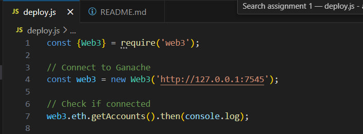
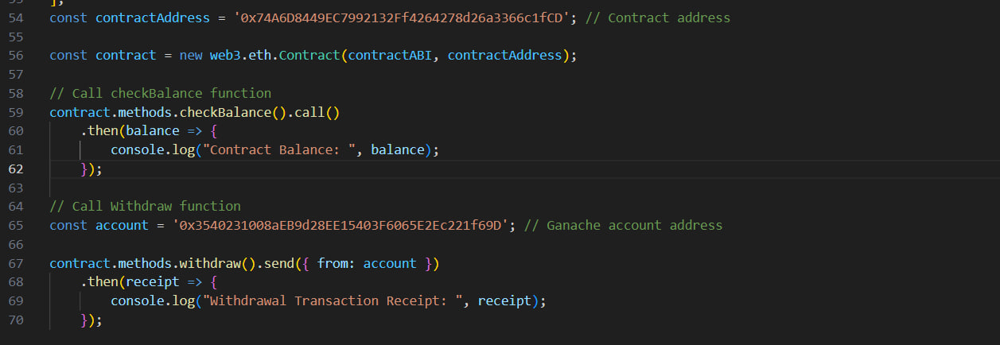
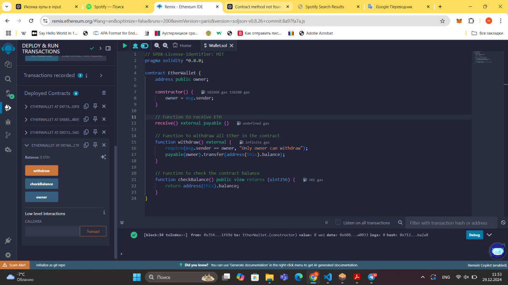
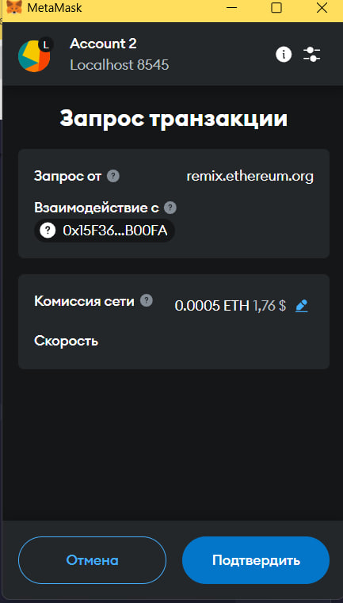
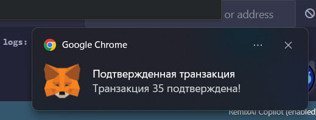
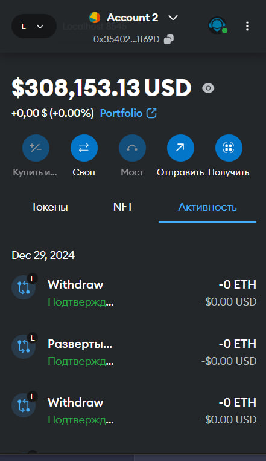
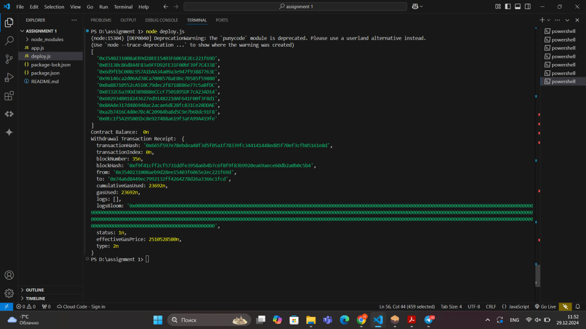
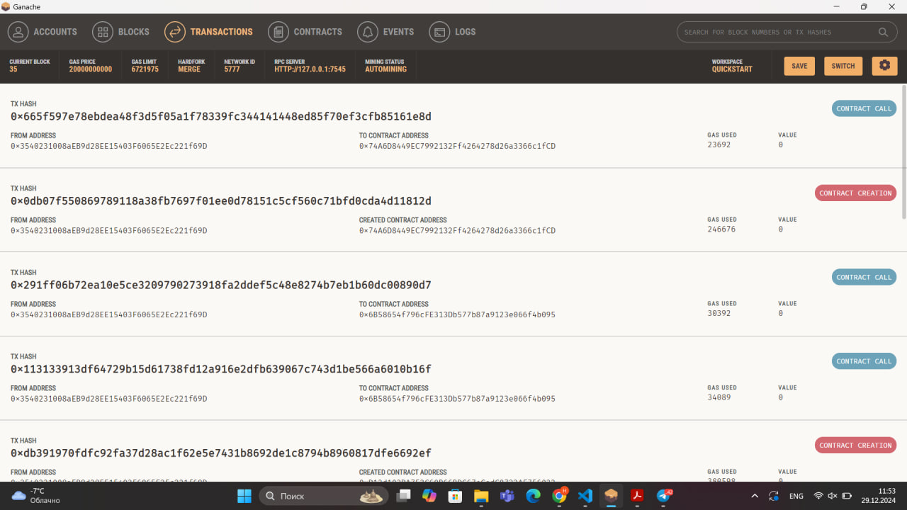
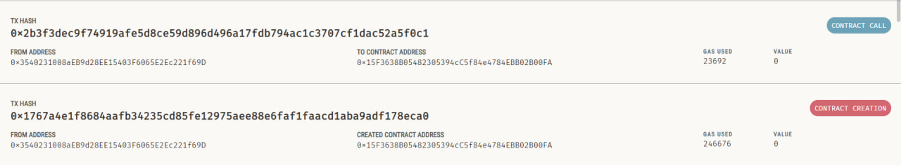

# Assignment 1
## Members
1. Azat Bolatbekov
2. Biba Koszhanova
3. Sultan Kissamedinov

## Description

The deployment script (deploy.js) is highlighted with the configuration necessary for connecting to the Ganache blockchain. Additionally, Web3 is utilized, declared as const {Web3}.

The deployment script open in VS Code, illustrating the JavaScript used to deploy the contract.

The smart contract code is shown in Remix IDE, where it was written, compiled, and tested. It includes functions to check the contract's Ether balance, withdraw all Ether to the owner's address, and accept Ether directly.

Displays the MetaMask popup requesting user confirmation for the transaction to deploy the smart contract.

Presents the MetaMask notification confirming the successful approval of the transaction.

The MetaMask account is displayed, showing the deployed transaction.

Captures the terminal output in VS Code after executing the deployment script, including transaction details such as the contract address and status.

Displays the Ganache interface, showing the details of the contract creation and any calls made to it.

## Conclusion

We developed a smart contract that can accept Ethereum, allow the owner to withdraw Ethereum, and check the contract's balance. This demonstrates the functionality of smart contracts on a blockchain network. The environment was prepared by setting up the Web3.js library to connect to the network. We also configured Ganache and Metamask to facilitate interaction with the blockchain. The smart contract was successfully deployed on a local test network, and its functions were verified by executing them within the configured environment.

